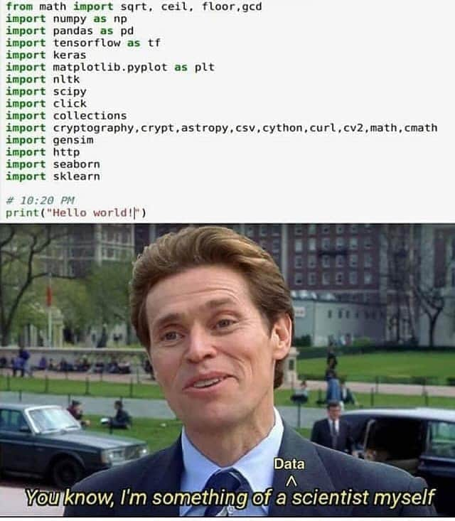

# Introduction

These stories were originally a part of the ML 'book'. They were moved to Randomly Accessed Memories to make the ML 'book' cleaner.

## Tru(uuuuu...)th about modern data scientists

The intent of this section is to bring the lack of competency in the data science industry to light in a gentlemanly (read: this is the best I can do) way. Let's get started!

Note: Few stories (not all) are exaggerated to (hopefully) enhance the impact. I will not name them, so have fun!

### A personal story

The article ["Using statistics to catch cheats and criminals"](https://physicstoday.scitation.org/do/10.1063/PT.5.010218/full/) reminds me of a cause that I stood for in 2014-15 that was blatant. The effects of the 'varoables' were *significant* beyond doubt. "Powerful people" were doing what they always do - abusing their power. Though the "agitation" was limited to a Facebook post and did not lead to significant change in behavior of "powerful people", it turned out to be a (emotionally) memorable event.

The affected people (majority, ~300 out of ~350) implicitly acknowledged the injustice, but never managed to voice their concerns in a structured way. During that phase of life I had nothing to lose, so I decided to write about the injustice on Facebook. Despite the best efforts of the "powerful people" I did not delete the post. The response from the exploited people was a pleasant surprise. In support of the agitation several people liked the post and unliked it within seconds in order to remove any publicly quotable evidence.

#### Learnings from the story

It is essential to be as less subjective (emotional) as possible to draw conclusions that conform to the principles of science. In the end there was no tangible outcome. The event was merely a standoff between two groups, but this led to few important insights:

1. Even though I did not have anything to lose, the post was made in a generic way. Firstly, if a particular group claimed to be offended by the post and wanted to take legal action against me, they first had to acknowledge their misdeeds publicly
2. Opinions can be wrong, but carefully tested hypotheses are scientific. Any form of dissent requires strong evidence and should be expressed in a way that either exploits uncertainties in law or does what's deemed lawful. Also, [ignorantia juris non excusat](https://en.wikipedia.org/wiki/Ignorantia_juris_non_excusat)
3. Being a 'yes man' is the norm despite the 'wannabe' nature of majority of the individuals. Society does not support whistleblowers and dissenters. This should not be shocking because upholding age-old practices is not always wrong; people who go against those practices are not always right

**Notes:**

1. The approach is summarized in [this](http://image.slidesharecdn.com/radicalinnovationfinal-140328064741-phpapp02/95/radical-rules-for-radical-innovation-29-638.jpg?cb=1406816127&fbclid=IwAR2wg4ZOJYvlaeB1qWcB7ykjLxSjzjI99Jy8IEOsFITchBroQPee2ONo7EQ) image. This is not my original content. I hope the right people were acknowledged.
2. I've had several unpleasant experiences with people who tried to abuse their power for their personal or professional benefits. The learnings from this event shaped my response to such situations

### The unreasonable effectiveness of ... lies, emotions and 'people connect'

I was one of two *developers* involved in mathematical modeling of product substitution. The timeline - 1 week - was highly unrealistic (if this sounds new, welcome to the world of consulting!). After reading few research papers I quickly understood that the mathematical models are very complicated, and involve creation of *consumer decision tree*, *nested modeling*, etc. After some brainstorming with the business team (i.e. the people who promised a working demo in 1 week without understanding the difficulties such as time complexity of storage/querying, quantitative analysis, coding, scaling, etc.), we came to a conclusion that we need to frame a metric that looks similar to *variance*. So we took a page out of economics of competition (specifically [HHI](https://en.wikipedia.org/wiki/Herfindahl%E2%80%93Hirschman_Index)) and designed a simple scoring function that was scalable! The math was so simple that even a high schooler with an average understanding of algebra would easily understand all the nuances of the model.

The fateful day arrived: we had to sell this model to a panel of experts. We prepared 'fancy' charts to abstract out all the (not so) sophisticated queries and code. We were aware that explaining charts remotely through an online meeting is difficult, so we requested a colleague (salesperson) to travel to the client's office on the other side of the planet. This decision proved to be a deal winner!

The meeting started as expected. The panel members were least bothered about the tools used or the sophistication of the algorithm, but were interested in the results. This was expected, but the panel members struggled to understand (uncluttered) scatter plots colored by categories, and could not understand simple mathematics such as *sum-product*. We quickly realized that the panel will lose interest before we share the astonishing results. This is where the salesperson stepped in - the salesperson started giving examples of well known crackers, claimed to have consumed them and suggested (well-known) substitutes. This sparked some interesting (emotional) conversations among the panel members about their favorite crackers and what they would buy if their favorite crackers were out of stock. Amazingly, our simple yet parsimonious mathematical model obtained the expected results - it predicted 4 out of 5 of their proposed (emotional) substitutes correctly (top 1 accuracy, and the top 3 predictions were sufficient to capture the misclassified substitute).

The salesperson's cameo worked positively. The sale went through! But let's analyze this situation objectively:

1. The salesperson never consumed any of those crackers
2. It takes just a simple Google search to identify the substitutes for the top selling crackers. Google may have a better model than we did!
3. The panel of experts were considering their choice of substitutes as the *gold standard*. The truth may be significantly different (for example: if the target demographic is significantly different from that of the panel), but it did not matter to them. Our sale would not have gone through if the data had not supported their choices.

This is a true story; this is (almost) every data scientist's story. Even if the story doesn't make sense, there is one important lesson to take back: we often use the data to support a story we already assume as the truth, or we use data to massage the ego of one or more people. This is outside the scope of science. In my opinion this is not data science!

### The story of normality of ... independent variables in linear regression

If the story wasn't depressing enough, there's more to come! After several disappointing years spent in a system that encourages mediocrity, yes-men, bigotry, credit-stealing, etc. I decided to travel to USA to pursue a higher degree. The journey was arduous - I had to cater to the need and greed of mediocre people while I was completing prerequisite courses, knowing that I may not get even a single admit. But it paid off - I got the admits I wanted. The time I spent in graduate school was invaluable. I created my own path, worked with awesome people - some over 10 years younger than me, studied interesting topics across departments, started working on interesting problems, and completed several courses from my course backlog (which was 100+ when I quit my job).

Finally, it was time to start attending interviews to get back to industry. The process was harder than expected - I did not receive even a single interview call, whereas, by the same time in the previous year I had three intership offers. Finally the interview call came; it was from a reputed company. I was confident because I had a good track record with interview conversions over the previous 4 years. The interview started as expected - the usual "Tell me something about yourself" followed by "Can you explain a data science project in detail". Things went smoothly in the initial phase despite the difficulties in understand each other's accent. Finally the technical questions started coming - "How do you interpret a linear regression model?", "What does p-value mean?", and finally "What are the assumptions on distribution of independent variables for a linear regression model to be valid?". I promptly answered all questions - "There are no assumptions on the distribution of independent variables in linear regression" to the final question.

At this time the interviewer, who was already uncomfortable with few points that tested his understanding of linear regression, responded "Are you sure?". I tried to keep it simple by saying "Yes", but the interviewer repeated the question several times, stated that the books state something else, and tried to force me to state that the independent variables should be normally distributed for linear regression. I quickly realized that the discussion was getting too personal, but I stood by my knowledge which, in this case, was right. The interviewer soon turned each point into an argument and was probing me continuously to find examples of topics that were known to him/her, but not known to me. We sailed through all terms (*just the names which, in my opinion, is a sheer overrepresentation of skill*) used in  variable transformations, feature selection, model evaluation, ... The interviewer finally found one - "Recursive Feature Elimination" (RFE) - and pounced on it.

The interviewer asked me: "If you don't know RFE, how do you perform feature elimination?". My answer was "Variable elimination requires a measure of relative importance of variables, and may vary from model to model. For example, in a linear model we can use p-value, F-...". The interviewer stopped me and asked me to design a scheme for feature elimination for random forest. So I started with cross-validation, full model building, reduced model building with each variable left out, and variable elimination based on model evaluation (cross-validated, averaged) metrics. The interviewer mentioned that the scheme was computationally expensive. I replied "There may be better schemes, but this is the best I can do with very little thought". The interviewer turned his/her attention back to RFE and asked for its computational complexity (to compare with the complexity of the scheme I developed). The answer was obvious "I already mentioned that I don't know RFE, so I cannot compare". I understood that the interviewer assumed that RFE is far more efficient compared the the scheme I built, and I gave him/her the benefit of doubt at the moment because I did not know RFE (*note: I was not aware of the name, but I knew how it works*).

The interview ended (negatively). What annoyed me the most was that it was extended by 20 minutes, and both of us wasted 20 minutes of our lives. I guessed the result (correctly), and decided to move on. The first step in learning from any experience is to look for learning opportunities. So the first step I took was to understand how RFE works. I opened [RFE's Scikit-learn documentation](https://scikit-learn.org/stable/modules/generated/sklearn.feature_selection.RFE.html) and quickly realized that it matched my computational scheme almost perfectly. I computed its computational complexity of RFE for random forest and found that it matched the complexity of the scheme I developed (*note: variable importance in RF (permutation importance variant that is widely used nowadays, and not the [Gini based importance that can be highly misleading](https://blog.hwr-berlin.de/codeandstats/variable-importance-in-random-forests/)) has the same complexity as the scheme discussed above*). Naturally, I burst into laughter, because the mediocrity that haunted me in the past was after me again. But this incident taught me a valuable lesson about myself - I had subconsciously decided to take the risk (and, therefore, to accept all the associated setbacks (such as remaining jobless as an international student)) to swim out of the pool of mediocrity towards a perceived shore. I'm probably not be the first person in this mental situation. It proved to be a motiviation rather than a stress; it raised my hopes instead of lowering it.

Under these circumstances I'm not trying to plead 'not guilty'. Standing one's ground (for example: in favor of facts) is a sign of guilt in the eyes of people with power who can manipulate emotions. There is no point in fighting such a battle because egoistic people (both parties in the above scenario) almost always perceive their result as a victory.

This story does not have a conclusion because of two reasons: a) I'm not a storyteller, b) the future is uncertain. These experiences gave me a vision that, in spite of involvement of mediocre people and lack of income, will keep me on my toes and force me to update myself. Life is too simple to be contained by trivial roadblocks.

The magnitude of risk faced by even the most passionate of data scientists is tiny compared to the risks faced by [Giordano Bruno](https://en.wikipedia.org/wiki/Giordano_Bruno), [Galileo Galilei](https://en.wikipedia.org/wiki/Galileo_Galilei), [Edmund Halley](https://en.wikipedia.org/wiki/Edmond_Halley), [Isaac Newton](https://en.wikipedia.org/wiki/Isaac_Newton), [Georg Cantor](https://en.wikipedia.org/wiki/Georg_Cantor), [Ludwig Boltzmann](https://en.wikipedia.org/wiki/Ludwig_Boltzmann), and several other scientists who were considered blasphemous. It is alright if your ML model failed to recommend the correct online news article to a customer; the modeler can forgive himself/herself even if the business people don't forgive him/her for not achieving 100% accuracy (on any arbitrary problem).

### How many imports should one make to call oneself a data scientist?

Consider this thought experiment - person A built an application on [R Shiny](https://shiny.rstudio.com/) by using widgets. Person B is a full stack developer with skills in R, Python, HTML, CSS, JavaScript, etc. Both 'full stack developers' meet and have a conversation.

A: "Hey B, I built a full-stack application that's very useful for business"

B: "That's great, can I take a look?"

A: "Unfortunately I can't show you the application, but I can tell you, it has every plot under the Sun and allows business users to view KPIs and dynamically drill down to the root cause"

B: "Sounds great! Which tech stack did you use?"

A: "Tech stack? What does that mean?"

B (sipping some water): "Oh, I meant the set of tools used as database, backend, middleware and frontend"

A: "Oh, I used R Shiny..."

B (almost unable to control the laughter):

A: "What so funny?"

B: "Nothing. Great work!"

B unethically peeks into A's computer to take a look at the application. It looked more or less like this:

A noticed B looking into the dashboard. The conversation resumed:

A: "Don't you think it's cool?"

B: "Sure, looks great!"

A: "I know you are a great full-stack deveoper. Do you have suggestions to improve my app?"

B: "Nothing much really. You may want to change the font style and size of the dashboard title"

A: "Ok, let me do it right away"

B curiously looks at A's steps to modify the font style and size. They were as follows:

1. Look at the documentation of ?shinydashboard::dashboardHeader. Problem could not be solved
2. Google "stackoverflow change shinydashboard header font style"
3. Copy paste the CSS code into a new file, save and build the HTML using R Studio

A: "Well, there you go! It was harder than I thought, but I did it!"

B: "Great work! It looks good now. Good luck!"

Moral: R Shiny uses widgets to abstract away the difficulties of building UI using HTML, CSS, JavaScript, etc. There are several simple components in R Shiny that require knowledge of the underlying concepts. Several widgetized components use HTML / JavaScript in the backend. Only simple applications can be built without knowing the underlying constructs.

The moral of this story was kept soft (intentionally), but there's an important message to the reader: importing packages without the curiosity to know (or understand) the underlying constructs is not a passion, it is a hobby. Most data scientists in the world, especially in body-shop companies, are pursuing a hobby and are getting paid for it - how cool is that?!

### "If only god can save our souls, only Cloud can save our neural networks"

It should be no surprise by now that I made up this quote.

This story, despite being slightly old, is relatively fresh in my memory because it has an emotional background. Background (emotional) story: For readers who are not Indian, [IIT-JEE](https://en.wikipedia.org/wiki/Joint_Entrance_Examination_%E2%80%93_Advanced) is considered one of the toughest exams in the world, and All India Rank 1 (AIR-1) is considered an achievement by itself, even if the person who achieves this feat does nothing in his/her life later. There was a legend about one of the AIR-1 candidates (don't remember the name or year) during IIT-JEE preparation days.

The story goes like this: a chemistry teach was teaching passionately while this person was joking playfully. The teacher, who was annoyed after a while, asked the student a tough question (some say it was the toughest question ever):

$$<some\ really\ complicated\ chemical> + <some\ other\ really\ complicated\ chemical> \to_{it's\ complicated} <another\ really\ complicated\ chemical>$$

Question: What is should one do to this reaction to get $<yet another\ really\ complicated\ chemical>$?

The student looked at the teacher, laughed, and said "pour water" in a sarcastic way to say "cool down". But that was the right answer - "pour water". This answer could not be found hidden in the P. W. Atkins (Physical Chemistry), Morrison & Boyd (Organic Chemistry), etc. The student went on to become AIR-1! The legend ends here, the relevance of this legend may become clear later.

Fast forward several years to 2017, the new story begins. I received an award in early 2017 for my contributions in "The unreasonable effectiveness of ... lies, emotions and 'people connect'" (the tangible contribution, not for the 'people connect'). As a result, I assumed that awards are important and that presentations in "Town Hall" and "India Team Meeting" have value.

Here's the typical flow of one of these meetings: 2+ grueling hours of ordinary people presenting ordinary work as extraordinary results (everyone believes them), followed by the C_O delivering 15-30 minutes of pure motivation, finally followed by 30 minutes of forward looking technical work. I learnt to wait for the final 30 minutes which were of importance to me. One presentation was on applications of neural networks in product categorization.

To my surprise this presentation was unusually candid - the team talked about "term frequency–inverse document frequency vectorizer", "stemming vs lemmatization", "GPUs to speed up matrix computation", etc. These are usually taboo in such meetings (even though they are forward looking) because they expose the extremely ordinary thought process of ordinary people. Only terms like "artificial intelligence", "scalable deep learning", etc. were allowed.

As the meeting progressed, the team highlighted their difficulties. Despite having cool ideas (*relatively speaking*) they were unsuccessful in training the neural network because the GPU ran out of memory in the very first iteration. In conclusion, the team moved their data and code to Cloud and achieved 97% accuracy by leveraging the scale. This is where I started having concerns. It should be no surprise that the ~10 MB text file can bloat up after performing TF-IDF, but there were other concerns. I questioned them during the meeting (taboo #2).

Me: "What vectorization (taboo already committed, so I'm not counting this) did you use?"

Them: "Term-document matrix"

Me: "What was your vocabulary size (taboo #3)?"

Them: "Vocabulary size? What does that mean?"

Me: "Number of columns in term-document matrix"

Them: "Oh, that was a lot! 1 million, or maybe more?"

Me (stunned): "Ok, looks odd. Did you discard words that appeared as little as once?"

Them: "No"

Me: "Ok, that's fine (not really, but it was necessary to say this to make progress in such conversations). What was your batch size (taboo #4)?"

Them: "Please explain"

Me: "Ok, how many rows did you take in while executing the training loop (taboo, maybe?)?"

Them: "We took the whole matrix - x million records"

Me: "Ok, that's fine (you know the drill). What was the data type of each cell?"

Them: "How am I supposed to know that?"

Me: "Ok, at least tell me this - how did you build the matrix?"

Them: "We used sklearn.you_can_find_this_online.just_Google_it.CountVectorizer"

Me: "Alright, I assume you have float32 type (**I was wrong, it's int64**), which is 4 bytes (taboo #5) per cell. (After some back of the envelope calculation) You are expected to use y GB of GPU memory, which is well above your machine's GPU memory"

Them: "Yes, precisely! That's why we moved it to Cloud"

Me: "Ok, that's not the point. Did you estimate the accuracy using binary (taboo #<whatever, I don't want to count>) vectors instead of count?"

Them: "No, we can always do that. Do you think it'll make it >97%?"

Me: "No, but it will reduce the GPU memory requirement by a factor of 32 (**I was wrong, it was 64**), which amounts to only y MB. It may (or may not) decrease your accuracy by a bit"

Them: "Then why should we do it?"

Me: "It's worth trying"

Them: "Cool, thank you (*performing slow claps to suggest that the meeting was over; probably signalling me to stop rambling*)! Any other suggestions from the rest of the company?"

Me: "Sorry, I'm not done (taboo #$\infty$). You should probably consider using mini batches (taboo #$\infty + 1$). Also storing it as sparse matrix (taboo #$\infty + 2$) may save more space. You can further compress the counts using delta compression (taboo #$\infty + 3$). A problem of this scale will probably never need to be on Cloud and can be run on a laptop (taboo #$\infty^\infty$)"

I had more suggestions around class balance (it was multiclass), but after this statement I was overcome by emotions - this was my "pour water" moment. This realization was very deep because I never had faith in myself and everyone around me was superior (at least on paper / designation). But was it really a "pour water" moment?

The team implemented few of my suggestions. They used a Cloud VM to run something that required at max 1 GB of GPU memory. Using binary vectorizer they achieved a higher accuracy than count vectorizer. So they reappeared in the next India Team Meeting and presented their results: 98% accuracy. Their work stole the spotlight as one of the most innovative and forward looking projects in the company. It should be obvious by now that I was not credited.

Moral: Leo Beebe (just the movie portrayal) in [Ford vs Ferrari](https://www.imdb.com/title/tt1950186/) movie is real. Sales (a.k.a. customer success) team treats techincal people as either:

- a scape goat when they fail
- a black sheep when they succeed

If you are a technical person who focuses on depth / details, be prepared to be treated like an animal!

## Lessons learnt from these experiences

I hope you had fun reading these stories. Though these accounts were not 100% accurate there are important lessons to be learnt from them that deal primarily with science, morality and interpersonal communication.

### I'm getting started. These experiences are scary as they sound commonplace

Welcome to data science! I sincerely wish you a happy journey. Fortunately the field is more diverse now than ever before. This makes each individual's journey almost unique. I tried to present scenarios that were experienced by myself and other people I know. You may or may not encounter any of these situations. I request you to write about your experiences without hiding the 'nasty' details because people like me may be able to learn from your experiences.

### I listened to your story and share similar experiences. Now what should I do?

At work a honest, sincere and pedantic data scientist  is *likely* to face one or more such scenarios irrespective of the workplace. It is important to note that we are employed in industry to make economical decisions to monetarily benefit a company in short/long term. Despite the pedantic approach it is important to have finite number of tangible deliverables to financially justify our paycheck. I don't have anything to say other than: make yourself responsible, accountable and efficient at work with the target to become one of the best data scientists in the future. This journey is not going to be short; this journey is not going to be without hurdles. But don't ever fail to justify your paycheck, and, if you can, be grateful to the *experiences* (employer may not necessarily play a part in this).

### I'm a member of the sales team. I feel offended!

I partially understand your point-of-view. Most sales team members have never done hands-on work. Try to understand the voice of your delivery team. Your tag line - "customer success" - is not only about getting 10x work done by your team in 1/10th of the time at the cost of their personal lives. Be clear and honest about the work you sign up for. Most team members need clarity from you so that they can play out a 'victory scenario' on paper (this phase is called 'planning') and attempt to execute it. Planning requires a set of time-bound goals that are mostly unchanging (with a certain predefined margin of error) over a given period of time (at least a sprint). Few 'bad apples' (like me) in your team will never be satisfied with the quality of work - your clarity will give them a clearer idea about their next steps; remember, making false promises is only going to make it worse for you and those 'bad apples'. Your clients will win only if your team wins on behalf of your clients. More importantly, to increase your accountability you should be appropriately penalized (monetarily) for changes in requirement (beyond the predefined margin) that happen during the time window (sprint or otherwise).

**Definition:** According to one of my former employers 'bad apple' refers to an employee who says "No" to a request to work 24/7 and wants to get a life.

